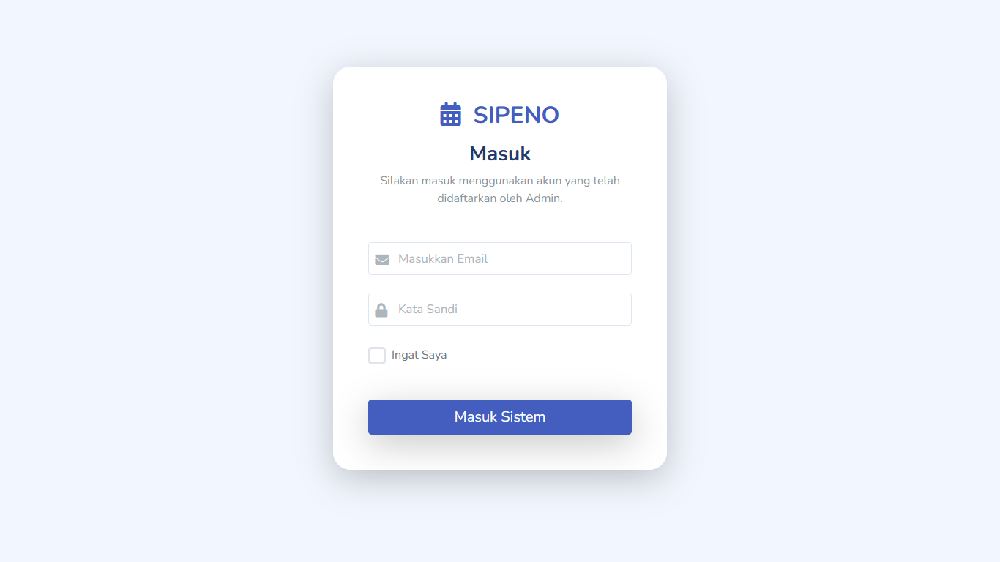
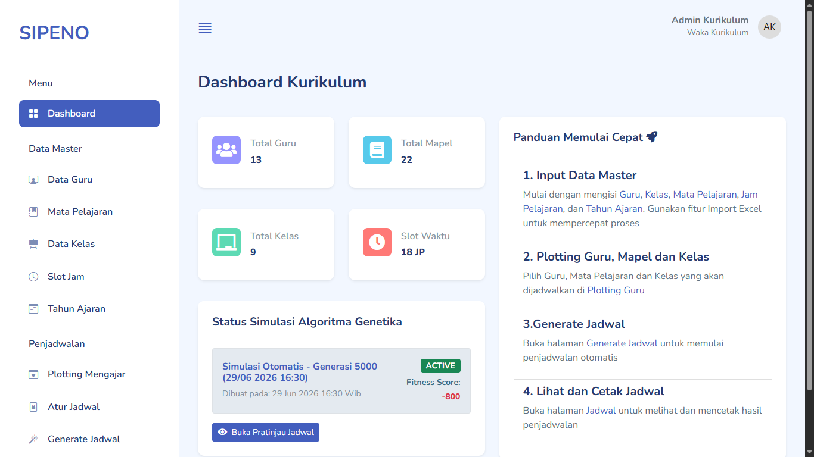

# 🗓️ SIPENO: Sistem Informasi Penjadwalan Otomatis

[](https://laravel.com)
[](LICENSE)
[](CONTRIBUTING.md)

**SIPENO** adalah aplikasi sistem informasi berbasis web yang dirancang untuk menyelesaikan masalah kompleks dalam penyusunan jadwal pelajaran di sekolah. Dengan memanfaatkan algoritma optimasi (seperti _Genetic Algorithm_ / Algoritma Genetika), aplikasi ini mampu menghasilkan jadwal bentrok-nol secara otomatis, memperhatikan ketersediaan guru, ruang kelas, batas jam mengajar, serta preferensi waktu berhalangan.

---

## 📸 Tampilan Aplikasi

<p align="center">
  
  <br>
  <i>Halaman Login Aplikasi</i>
</p>

<p align="center">
  
  <br>
  <i>Halaman Dashboard Aplikasi</i>
</p>

---

## ✨ Fitur Unggulan

- **⚡ Otomatisasi Penjadwalan (Auto-Generate):** Menyusun ribuan kombinasi jadwal hanya dengan satu klik menggunakan algoritma cerdas tanpa risiko bentrok (_Zero-Conflict_).
- **🔒 Manajemen Hak Akses (Multi-user):** Pembagian peran yang jelas untuk **Admin/Kurikulum** (mengelola data & generate jadwal) dan **Guru** (melihat jadwal & mengajukan waktu berhalangan).
- **🛠️ Manajemen Data Master Fleksibel:** Pengelolaan data Guru, Mata Pelajaran, Kelas, dan Tahun Akademik secara dinamis.
- **📅 Batasan & Parameter Kustom (Constraints):**
    - Maksimum jam mengajar per hari untuk tiap guru.
    - Kombinasi hari dan jam berhalangan bagi guru tertentu.
- **📥 Ekspor Laporan Mudah:** Cetak dan ekspor hasil jadwal pelajaran ke format **PDF** per kelas atau per guru.

---

## 🛠️ Teknologi yang Digunakan

Aplikasi ini dibangun menggunakan _modern web stack_ untuk memastikan performa tinggi dan kemudahan pemeliharaan:

- **Backend Framework:** [Laravel 13](https://laravel.com)
- **Frontend Interface:** [Mazer Template](https://zuramai.github.io/mazer/)
- **Database:** MySQL
- **In-Memory Cache (Optional):** Redis (untuk mempercepat komputasi pencarian jadwal)
- **Package Pendukung:** Spatie Laravel Permission (Manajemen Role), Maatwebsite Excel (Ekspor Data).

---

## 🚀 Panduan Penginstalan (Installation Guide)

Ikuti langkah-langkah berikut untuk menjalankan aplikasi **SIPENO** di lingkungan lokal Anda:

### 📋 Prasyarat Sistem

Pastikan perangkat Anda sudah terinstal:

- [PHP >= 8.3](https://www.php.net/downloads.php)
- [Composer](https://getcomposer.org/download/)
- [Laragon >= 6](https://github.com/leokhoa/laragon/releases)

**NB:** Untuk lokal server gunakan sesuai keinginan anda (XAMPP, Laravel Herd, dll)

---

### 🛠️ Langkah-Langkah Instalasi

1.  **Kloning Repositori**

    ```bash
    git clone https://github.com/pratamapujia/sipeno.git
    cd sipeno
    ```

2.  **Instalasi Dependensi PHP**

    ```bash
    composer install
    ```

3.  **Konfigurasi Environment (`.env`)**
    Salin file `.env.example` menjadi `.env`:

    ```bash
    cp .env.example .env
    ```

    Buka file `.env` menggunakan teks editor pilihan Anda, kemudian sesuaikan konfigurasi database Anda:

    ```env
    DB_CONNECTION=mysql
    DB_HOST=127.0.0.1
    DB_PORT=3306
    DB_DATABASE=db_sipeno
    DB_USERNAME=root
    DB_PASSWORD=
    ```

4.  **Generate Application Key**

    ```bash
    php artisan key:generate
    ```

5.  **Migrasi Database & Seeding Data Utama**
    Jalankan perintah ini untuk membuat struktur tabel beserta data awal (_default admin_, master guru, master kelas, master mata pelajaran dan tahun ajaran):

    ```bash
    php artisan migrate --seed
    ```

6.  **Menjalankan Server Lokal**
    Aplikasi Anda sekarang siap digunakan! Jalankan perintah berikut untuk memulai server development:
    ```bash
    php artisan serve
    ```
    Buka browser Anda dan akses tautan: `http://127.0.0.1:8000`

---

## 💡 Cara Penggunaan Singkat

1.  **Login ke Sistem:** Gunakan akun admin hasil _seeding_ awal (misal: `admin@sekolah.com` / password: `admin123`).
2.  **Input Data Slot Jam:** Masukkan data Slot jam sesuai dengan aturan jam sekolah anda.
3.  **Atur Batasan (Constraints):** Masukkan waktu berhalangan guru jika ada.
4.  **Generate Jadwal:** Masuk ke menu _Penjadwalan_, lalu klik tombol **"Generate Jadwal"**. Sistem akan memproses alokasi terbaik secara otomatis.
5.  **Publikasi:** Setelah hasil keluar dan divalidasi, klik _Aktifkan_ agar jadwal dapat dilihat oleh seluruh guru.

---

## 📄 Lisensi

Proyek ini dilisensikan di bawah **Lisensi MIT** - lihat file [LICENSE](LICENSE) untuk detail lebih lanjut.

---

_Dibuat dengan 💻 dan ☕ untuk kemajuan efisiensi administrasi pendidikan._
